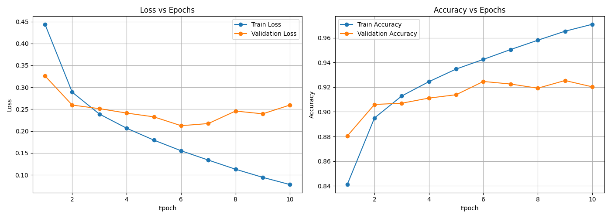
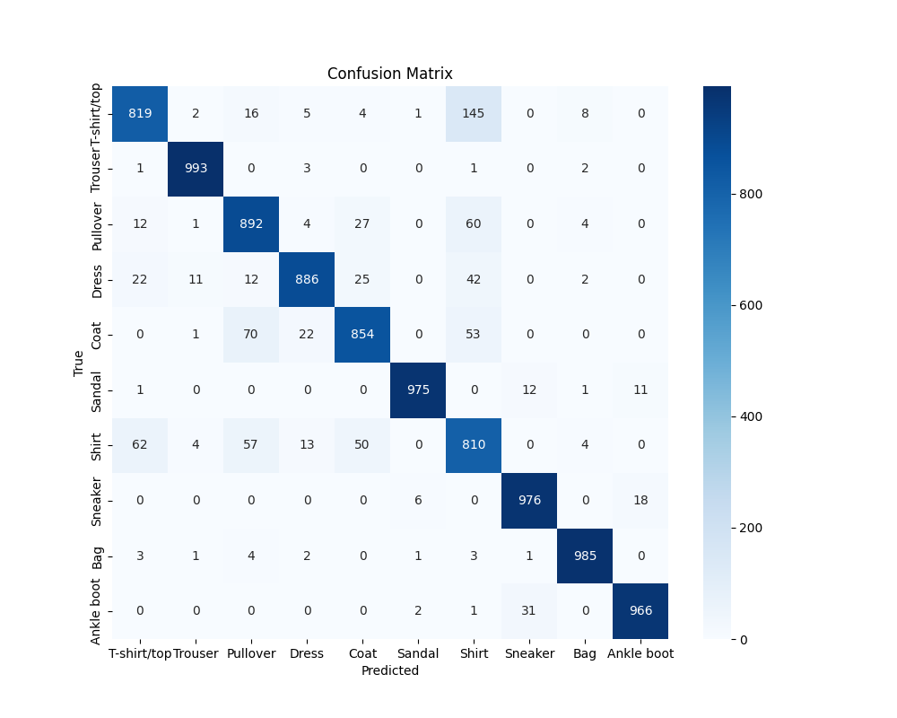
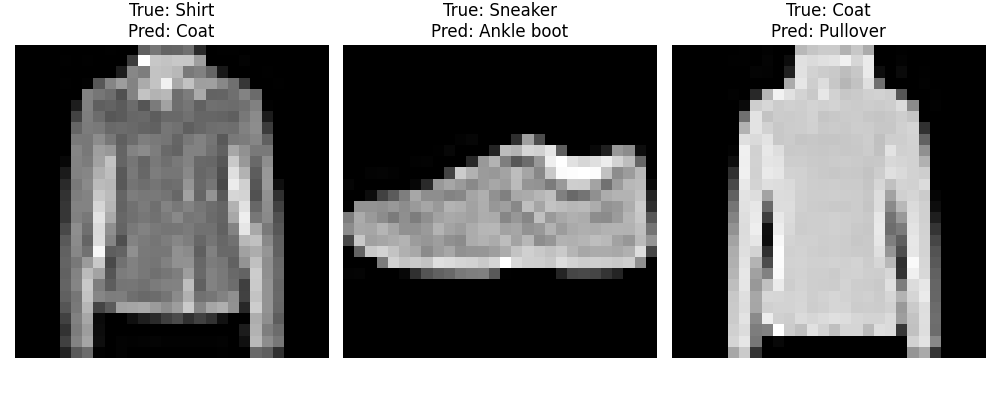
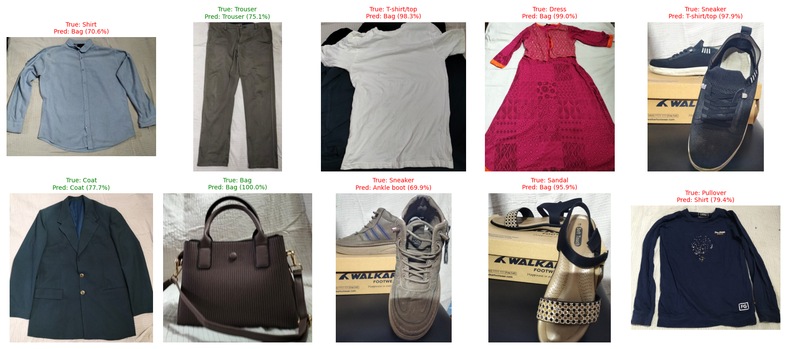

# CNN Image Classification — FashionMNIST

**Student ID:** 220143
**Assignment:** CNN Image Classification with PyTorch

## Overview

This project implements a Convolutional Neural Network (CNN) in PyTorch to classify clothing items. The model is trained on the standard FashionMNIST dataset and then tested on 10 real-world photos taken with a smartphone.

## Dataset

- **Standard dataset:** FashionMNIST (60,000 training images, 10,000 test images), loaded automatically via `torchvision.datasets`.
- **Classes (10):** T-shirt/top, Trouser, Pullover, Dress, Coat, Sandal, Shirt, Sneaker, Bag, Ankle boot.
- **Image format:** 28×28 grayscale.
- **Custom data:** 10 real smartphone photos of distinct clothing items (`dataset/`), automatically pulled into the notebook via `!git clone` — no manual uploads required at runtime.

## Preprocessing

- Standard data: `ToTensor()` → `Normalize(mean=0.5, std=0.5)`.
- Custom photos: resized to 28×28, converted to grayscale, **color-inverted** to match FashionMNIST's light-on-dark pixel convention, contrast-enhanced (`autocontrast`), then normalized using the same pipeline as training data.
  - *Note:* an early version of this pipeline predicted "Bag" for all 10 custom photos with high confidence. Investigation showed FashionMNIST stores light-colored garments on a black background, while phone photos captured dark garments on a light background — the opposite polarity. Adding a color-inversion step fixed this and produced varied, meaningful predictions.

## Model Architecture

A CNN built with `nn.Module`, consisting of:

- **Conv Block 1:** Conv2d(1→32, 3×3, padding=1) → ReLU → MaxPool2d(2×2)
- **Conv Block 2:** Conv2d(32→64, 3×3, padding=1) → ReLU → MaxPool2d(2×2)
- **Fully Connected:** Flatten (64×7×7) → Linear(3136→128) → ReLU → Linear(128→10)

**Training setup:**
- Loss: `CrossEntropyLoss`
- Optimizer: `Adam` (lr=0.001)
- Batch size: 64
- Epochs: 10
- Train/validation split: 90% / 10% of training data

## Results

**Final Test Accuracy (standard FashionMNIST test set): 91.56%**

### Training History

### Confusion Matrix

### Error Analysis

### Custom Real-World Predictions

**Custom photo accuracy: 3/10 correct.**

Real-world performance was noticeably lower than test-set performance, for several understandable reasons:
- Shrinking full-resolution phone photos down to 28×28 discards most fine detail, leaving mostly coarse silhouette information.
- FashionMNIST images are tightly cropped and isolated on a plain background; custom photos included natural background context (bed sheets, floor), adding visual noise.
- Some FashionMNIST classes (Shirt, Pullover, Coat, T-shirt/top) are visually similar even in the original dataset, as confirmed during data exploration — this ambiguity carries over to real photos.
- Items with simple, solid silhouettes (trousers, bags) were classified most reliably; items with prints, drapes, or complex textures (T-shirt with graphic print, dress) were harder for the model.

## Files

- `220143.ipynb` — full notebook (data loading, exploration, training, evaluation, custom predictions)
- `model/220143.pth` — trained model weights
- `dataset/` — 10 custom smartphone photos
- `*.png` — result plots referenced above

## Reproducing

Open `220143.ipynb` in Google Colab and select **Run All**. The notebook automatically clones this repository for the custom images, downloads FashionMNIST via `torchvision`, trains the model, and generates all outputs above with no manual file uploads required.
